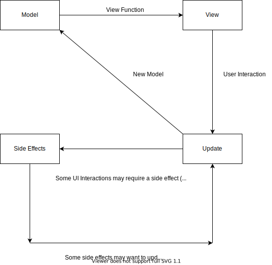

# elm-architecture

Hello there, fellow Haskeller! This library is an attempt to build an [Elm](https://elm-lang.org/)-like framework in Haskell.

It uses [sdl2](https://github.com/haskell-game/sdl2) and [sdl-ttf](https://github.com/haskell-game/sdl2-ttf) for rendering.

## Basics

The app is built on 4 pillars. They define everything that the does, and displays.
1. Model - This defines the state of the app
2. View - This defines how the app looks for a particular instance of Model.
3. Update - This defines how the app updates itself in response to user interactions.
4. Action - This defines how an effectful(having side-effects) task can be triggered from the UI.

## Flow



## Types

The function that is responsible for creating and displaying your entire app is this one:

```haskell
elmArchitecture :: (Eq msg, Eq model) => Requirements msg model action -> IO ()
```

### Requirements

```haskell
data Requirements msg model action = Requirements
    { initModel :: model
    , updateFn :: msg -> model -> (model, Maybe action)
    , viewFn :: model -> App msg
    , actionFn :: action -> IO msg
    }
```

As you can see, most of the types above are user-defined, the only exception being `App`.

## TODO

- [ ] Add documentation for view types, including `App`.
- [ ] Add documentation for examples, inside `examples` directory.
- [ ] Add more rendering capabilities (scrolling etc).
- [ ] Add as a library to Hackage/Stackage.
